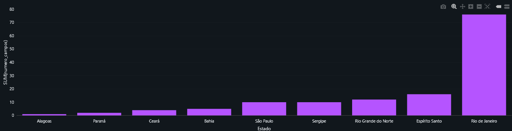
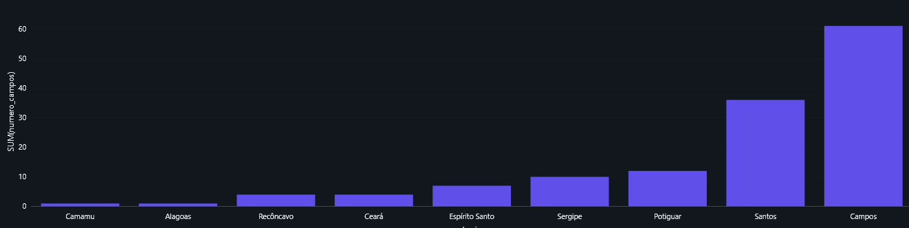
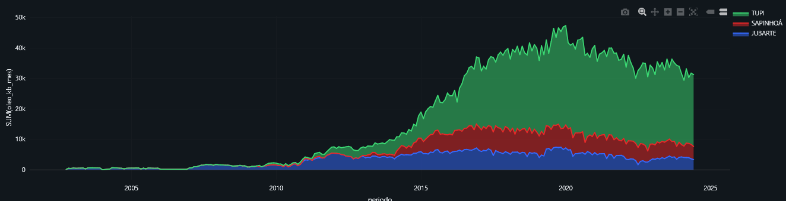
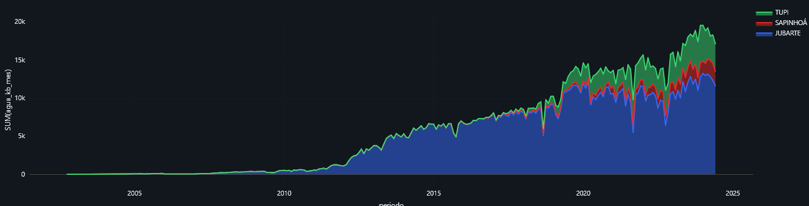
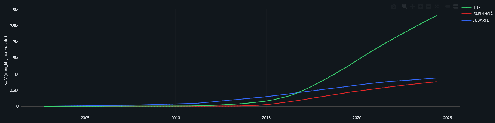
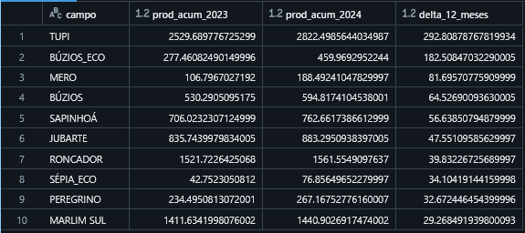

# 🛢️ Análise Histórica da Produção de Petróleo Offshore no Brasil (1980–2024)

## 📑 Tabela de Conteúdos

- [Introdução](#-introdução)
- [Objetivo](#-objetivo)
- [Arquitetura e Pipeline de Dados](#️-arquitetura-e-pipeline-de-dados)
- [Modelagem e Catálogo de Dados](#-modelagem-e-catálogo-de-dados)
- [Carga e Processamento com ETL](#-carga-e-processamento-com-etl)  
- [Análises e Respostas](#-análises-na-camada-ouro)  
- [Discussões e Insights](#-discussões-e-insights)  
- [Repositório de Notebooks](#-repositório-de-notebooks)  
- [Referências](#-referências)  

---

## 🧭 Introdução

A produção de petróleo e gás offshore no Brasil — especialmente nas reservas do pré-sal — representa um dos maiores ativos energéticos do século XXI, com impacto direto na economia nacional, na segurança energética e no cenário geopolítico global. Entender a evolução, o comportamento produtivo e os padrões operacionais desses campos é fundamental para subsidiar decisões estratégicas, otimizar a gestão de recursos e apoiar políticas públicas.

Contudo, a análise desse tipo de dado apresenta desafios estruturais: a fragmentação dos arquivos, a necessidade de tratamento extensivo, e a ausência de uma base integrada que permita comparações históricas e análises avançadas. Os dados são disponibilizados pela **Agência Nacional do Petróleo (ANP)** em arquivos CSV mensais, com alto grau de granularidade, mas exigem pré-processamento rigoroso para que possam ser utilizados de forma eficiente.

Este projeto se propõe a resolver esse problema técnico e analítico através da construção de um pipeline estruturado em camadas, inspirado na arquitetura **medallion** (Bronze, Prata e Ouro), utilizando a plataforma **Databricks** como ambiente principal de desenvolvimento e execução.

Além do processamento e enriquecimento dos dados, o projeto também propõe uma abordagem analítica profunda, integrando métricas derivadas, visualizações e questionamentos estratégicos sobre a produção offshore brasileira. O resultado é uma base sólida e reutilizável para exploração, análise e tomada de decisão baseada em dados confiáveis.

A fonte dos dados é a **Agência Nacional do Petróleo (ANP)**, que publica mensalmente arquivos CSV com informações por poço produtor. Contudo, devido à exigência de captcha no site da ANP, os dados foram previamente baixados e incluídos neste repositório nas pastas organizadas por ano [`datasets/monthly_production/`](./datasets/monthly_production), viabilizando um pipeline de dados automatizado a partir dos arquivos locais.

## 🎯 Objetivo

O objetivo desta análise é transformar os dados brutos de produção de petróleo e gás em informações valiosas, que permitam compreender melhor o comportamento da produção nacional — com foco especial nos campos offshore.

A partir disso, buscamos responder perguntas estratégicas como:

- Quantos campos produtores estão ativos em cada estado e em cada bacia?
- Qual o número de campos offshore atualmente em produção?
- Quais são os campos offshore com maior produção de óleo nos últimos 12 meses da amostra?
- Como evolui a produção de óleo, gás natural e água nos importantes campos da Bacia de Campos Tupi, Sapinhoá e Jubarte?
- Qual é o perfil de maturação desses campos com base na produção acumulada?
- Como variam, ao longo do tempo, os índices GOR (Gas-Oil Ratio) e GOW (Gas-Over Water) nesses campos?

Estas perguntas orientam toda a etapa analítica e servirão como base para as respostas e interpretações discutidas na seção de Análise.

## 🏗️ Arquitetura e Pipeline de Dados

A arquitetura deste projeto foi construída com base no modelo **Medallion Architecture**, organizado em três camadas principais: **Bronze**, **Prata** e **Ouro**. Essa estrutura permite rastreabilidade, reprocessamento eficiente e separação clara entre dados brutos, tratados e analíticos.

A execução do pipeline foi feita na plataforma **Databricks**, utilizando notebooks em PySpark, aproveitando o suporte nativo à engine Delta Lake, ao versionamento de dados e à performance otimizada para leitura e escrita em grandes volumes.

### 🔸 Camada Bronze — Ingestão

- Leitura dos arquivos CSV mensais da produção por poço diretamente da pasta `datasets/monthly_production/`.
- Padronização da leitura usando `;` como delimitador e codificação `'latin-1'`, preservando os dados originais conforme disponibilizados pela ANP.
- Escrita em Delta Lake, com conversões mínimas de tipos e sem aplicação de regras de negócio.
- Objetivo: manter os dados íntegros e rastreáveis, servindo como "fonte da verdade".

### 🔸 Camada Prata — Limpeza e Estruturação

- Tratamento de dados faltantes, remoção de duplicatas e padronização de colunas.
- Conversões de unidades: produção de petróleo e gás padronizada para barris por dia (bbl/d) e m³/dia, conforme necessário.
- Separação em dois DataFrames principais: **produção por poço** e **características físico-químicas do óleo e gás**, permitindo flexibilidade para análises mais direcionadas.
- Escrita em Delta Lake com esquema estruturado e validado.

### 🔸 Camada Ouro — Enriquecimento e Métricas Derivadas

- Agregações temporais por campo, bacia, estado e tipo de fluido.
- Cálculo de métricas como:
  - Volume mensal (convertido de produção diária).
  - GOR (Gas-Oil Ratio) e GOW (Gas over Water).
  - Produção acumulada por campo.
- Integração dos dados em uma estrutura flat analítica, pronta para dashboards, exploração via SQL e análise visual.

Essa arquitetura garante escalabilidade, reutilização e facilidade de manutenção, permitindo que o pipeline seja adaptado para incluir novos dados mensais e que análises históricas possam ser reproduzidas com consistência. O modelo foi desenhado para suportar tanto análises exploratórias quanto estudos estratégicos mais aprofundados.

## Modelagem e Catálogo de Dados

A modelagem dos dados deste projeto adota uma arquitetura em camadas (Bronze, Prata e Ouro), com o objetivo de garantir rastreabilidade, qualidade e reutilização dos dados em análises futuras. 

Na camada Bronze, optamos por manter todas as colunas disponíveis, incluindo propriedades físico-químicas e frações de hidrocarbonetos, por se tratar de uma camada bruta que visa garantir a rastreabilidade completa dos dados originais. Já na camada Prata, colunas relacionadas à composição físico-química do óleo e frações de hidrocarbonetos foram omitidas. A decisão foi baseada no foco principal da análise, que está centrada na produção, sua evolução temporal e características operacionais.

### 🗂️ Catálogo de Dados

#### 🔹 Camada Bronze — `producao_db.bronze`

| Campo                          | Tipo     | Descrição                                                  |
|--------------------------------|----------|-------------------------------------------------------------|
| estado                         | STRING   | Estado de localização do poço                              |
| bacia                          | STRING   | Nome da bacia sedimentar                                   |
| nome_poco_anp                  | STRING   | Nome do poço segundo a ANP                                 |
| nome_poco_operador             | STRING   | Nome do poço segundo o operador                            |
| campo                          | STRING   | Nome do campo de produção                                  |
| operador                       | STRING   | Nome da operadora                                          |
| numero_contrato                | STRING   | Número do contrato do ativo                                |
| periodo                        | STRING   | Mês/ano da produção (formato texto)                        |
| oleo_bbldia                    | DOUBLE   | Produção de óleo em bbl/dia                                |
| condensado_bbldia              | DOUBLE   | Produção de condensado em bbl/dia                          |
| petroleo_bbldia                | DOUBLE   | Soma de óleo + condensado em bbl/dia                       |
| gas_natural_m3dia_assoc        | DOUBLE   | Gás associado (m³/dia)                                     |
| gas_natural_m3dia_nassoc       | DOUBLE   | Gás não-associado (m³/dia)                                 |
| gas_natural_m3dia_total        | DOUBLE   | Gás total produzido (m³/dia)                               |
| volume_gas_royalties_m3mes     | DOUBLE   | Volume de gás sujeito a royalties no mês (m³)             |
| agua_bbldia                    | DOUBLE   | Produção de água em bbl/dia                                |
| instalacao_destino             | STRING   | Nome da instalação de destino                              |
| tipo_instalacao                | STRING   | Tipo da instalação (FPSO, plataforma fixa etc.)            |
| tempo_producao_hspormes        | INTEGER  | Tempo de produção no mês em horas                          |
| periodo_carga                  | STRING   | Período de carga dos dados                                 |
| corrente                       | STRING   | Tipo de corrente do petróleo                               |
| grau_api                       | STRING   | Grau API do óleo                                           |
| fracao_destilados_lev_corte    | STRING   | Temperatura de corte de destilados leves                   |
| fracao_destilados_lev_vol      | STRING   | Volume de destilados leves                                 |
| fracao_destilados_med_corte    | STRING   | Temperatura de corte de destilados médios                  |
| fracao_destilados_med_vol      | STRING   | Volume de destilados médios                                |
| fracao_destilados_pes_corte    | STRING   | Temperatura de corte de destilados pesados                 |
| fracao_destilados_pes_vol      | STRING   | Volume de destilados pesados                               |
| perc_vol_metano                | STRING   | Teor de metano (% vol.)                                    |
| perc_vol_etano                 | STRING   | Teor de etano (% vol.)                                     |
| perc_vol_propano               | STRING   | Teor de propano (% vol.)                                   |
| perc_vol_isobutano             | STRING   | Teor de isobutano (% vol.)                                 |
| perc_vol_butano                | STRING   | Teor de butano (% vol.)                                    |
| perc_vol_isopentano            | STRING   | Teor de isopentano (% vol.)                                |
| perc_vol_npentano              | STRING   | Teor de n-pentano (% vol.)                                 |
| perc_vol_hexanos               | STRING   | Teor de hexanos (% vol.)                                   |
| perc_vol_heptanos              | STRING   | Teor de heptanos (% vol.)                                  |
| perc_vol_octanos               | STRING   | Teor de octanos (% vol.)                                   |
| perc_vol_nonanos               | STRING   | Teor de nonanos (% vol.)                                   |
| perc_vol_decanos               | STRING   | Teor de decanos (% vol.)                                   |
| perc_vol_undecanos             | STRING   | Teor de undecanos (% vol.)                                 |
| perc_vol_oxigenio              | STRING   | Teor de oxigênio (% vol.)                                  |
| perc_vol_nitrogenio            | STRING   | Teor de nitrogênio (% vol.)                                |
| perc_vol_gas_carbonico         | STRING   | Teor de gás carbônico (% vol.)                             |
| densidade_glp_gas              | STRING   | Densidade do GLP na fase gasosa                            |
| densidade_glp_liquido          | STRING   | Densidade do GLP na fase líquida                           |
| pcs_gp_kj_m3                   | STRING   | Poder calorífico superior (kJ/m³)                          |
| data_atualizacao               | STRING   | Data de atualização da linha de produção                   |

---

#### 🟦 Camada Prata — `producao_db.prata`

| Campo                          | Tipo       | Descrição                                             |
|--------------------------------|------------|--------------------------------------------------------|
| estado                         | STRING     | Estado de localização do poço                         |
| bacia                          | STRING     | Nome da bacia sedimentar                              |
| nome_poco_anp                  | STRING     | Nome oficial do poço (ANP)                            |
| campo                          | STRING     | Campo de produção                                     |
| operador                       | STRING     | Nome da operadora                                     |
| periodo                        | TIMESTAMP  | Mês de referência                                     |
| oleo_bbldia                    | DOUBLE     | Produção de óleo (bbl/dia)                            |
| condensado_bbldia              | DOUBLE     | Produção de condensado (bbl/dia)                      |
| petroleo_bbldia                | DOUBLE     | Produção total de petróleo (óleo + condensado)        |
| gas_natural_m3dia_assoc        | DOUBLE     | Produção de gás associado (m³/dia)                    |
| gas_natural_m3dia_nassoc       | DOUBLE     | Produção de gás não-associado (m³/dia)                |
| gas_natural_m3dia_total        | DOUBLE     | Produção total de gás (m³/dia)                        |
| volume_gas_royalties_m3mes     | DOUBLE     | Volume sujeito a royalties (m³/mês)                   |
| agua_bbldia                    | DOUBLE     | Produção de água (bbl/dia)                            |
| instalacao_destino             | STRING     | Nome da instalação de destino                         |
| tipo_instalacao                | STRING     | Tipo da instalação                                    |
| tempo_producao_hspormes        | INTEGER    | Tempo de produção no mês (em horas)                   |

---

#### 🟨 Camada Ouro — `producao_db.ouro`

| Campo                           | Tipo       | Descrição                                                  |
|----------------------------------|------------|-------------------------------------------------------------|
| estado                           | STRING     | Estado da instalação ou poço                               |
| bacia                            | STRING     | Nome da bacia sedimentar                                   |
| nome_poco_anp                    | STRING     | Nome oficial do poço                                       |
| campo                            | STRING     | Nome do campo de produção                                  |
| operador                         | STRING     | Nome da operadora                                          |
| periodo                          | TIMESTAMP  | Mês de referência                                          |
| instalacao_destino               | STRING     | Nome da instalação de destino                              |
| tipo_instalacao                  | STRING     | Tipo da instalação                                         |
| tempo_producao_hspormes         | DOUBLE     | Horas de produção no mês                                   |
| gas_natural_mmscf_assoc          | DOUBLE     | Gás associado (em MMSCF/dia)                               |
| gas_natural_mmscf_nassoc         | DOUBLE     | Gás não-associado (MMSCF/dia)                              |
| gas_natural_mmscf_total          | DOUBLE     | Gás total (MMSCF/dia)                                      |
| volume_gas_royalties_mmscf       | DOUBLE     | Volume de gás sujeito a royalties (MMSCF)                  |
| oleo_kbd                         | DOUBLE     | Produção de óleo (KBD)                                     |
| condensado_kbd                   | DOUBLE     | Produção de condensado (KBD)                               |
| petroleo_kbd                     | DOUBLE     | Produção de petróleo (óleo + condensado) em KBD            |
| agua_kbd                         | DOUBLE     | Produção de água (KBD)                                     |
| dias_no_mes                      | INT        | Número de dias no mês                                      |
| gas_natural_assoc_mmscf_mes      | DOUBLE     | Produção mensal de gás associado                           |
| gas_natural_nassoc_mmscf_mes     | DOUBLE     | Produção mensal de gás não-associado                       |
| gas_natural_total_mmscf_mes      | DOUBLE     | Produção mensal de gás total                               |
| volume_gas_royalties_mmscf_mes  | DOUBLE     | Volume mensal de gás sujeito a royalties                   |
| oleo_kb_mes                      | DOUBLE     | Produção mensal de óleo (mil barris)                       |
| condensado_kb_mes                | DOUBLE     | Produção mensal de condensado (mil barris)                 |
| petroleo_kb_mes                  | DOUBLE     | Produção mensal total de petróleo (mil barris)             |
| agua_kb_mes                      | DOUBLE     | Produção mensal de água (mil barris)                       |
| gor                              | DOUBLE     | Gas-Oil Ratio (m³/bbl ou MMSCF/KBD equivalente)           |
| gow                              | DOUBLE     | Gas-Over-Water Ratio (indicador analítico)                 |

---

## Carga e Processamento com ETL

Os dados utilizados neste projeto são provenientes da **Agência Nacional do Petróleo (ANP)**, que disponibiliza relatórios mensais de produção de petróleo, gás, água e derivados por poço. Entretanto, os arquivos originais exigem captcha para download, o que inviabiliza a automação direta da coleta e dificulta a replicação dos estudos. Para contornar essa limitação e viabilizar a replicabilidade dos processos, os arquivos foram previamente organizados e disponibilizados no repositório público do GitHub, com estrutura semelhante à da ANP, separados por ano e tipo de produção (`Mar` e `Pré-Sal`).

📁 [datasets/monthly_production](https://github.com/brainopensource/datascience-mvp/tree/main/datasets/monthly_production)

O Scraper gera dinamicamente os links por ano pra mar e pré-sal, carregando os CSVs em dataframes pandas, e apenas tem as colunas renomeadas para evitar problemas na criação de bancos de dados removendo espaços ou caracteres especiais. Também são concatenados alguns arquivos CSVs, pois o dado de Mar e do Pré-Sal não vem junto da fonte ANP. Mas isso é indiferente pois na tabela bronze do Banco de Dados será tudo uma única tabela, já que as colunas são as mesmas.

## Análises e Respostas

Durante a análise dos dados de produção, buscamos responder a diversas perguntas-chave sobre o cenário nacional e regional da exploração offshore. Inicialmente, investigamos quantos campos produtores estão ativos por estado e por bacia, além de identificar o número total de campos offshore em operação. Ampliando a visão, analisamos quem são os maiores produtores de óleo offshore no Brasil nos últimos 12 meses, avaliando quais operadores aumentaram ou reduziram sua produção e construindo um ranking com os 10 maiores produtores nacionais. Em uma abordagem mais focada, examinamos a evolução de produção nos campos de Tupi, Sapinhoá e Jubarte, com foco na produção média, acumulada e nos indicadores GoR e GoW para entender a eficiência dos campos e suas tendências de desempenho. Essas análises fornecem uma base sólida para interpretações estratégicas da produção offshore brasileira e utilizando a estrutura atual do trabalho poderíamos ampliar o escopo pra responder outras perguntas semelhantes ou analisar outros campos offshore no Brasil.

Na cama ouro respondemos as perguntas de análises gerais e análises focadas em campos importantes escolhidos arbitrariamente por fins de estudo e exemplificação do uso do trabalho como framework pra análises futuras e treinamento de modelos de Machine Learning de maneira mais automatizada e integrada. 

### 🔹 Análises Gerais

- Total de **campos produtores por estado**.
- Total de **campos produtores por bacia**.
- Número total de **campos offshore em produção**.
- Identificação dos **maiores produtores de óleo offshore** nos **últimos 12 meses da amostra**.
- Cálculo do **delta de produção de óleo** (crescimento ou declínio).
- Geração de um **ranking com os 10 maiores produtores offshore** do Brasil no período analisado.

### 🔹 Análises Focadas – Bacia de Campos (Tupi, Sapinhoá e Jubarte)

Analisamos três campos relevantes da Bacia de Campos para entender seu comportamento de produção:

- **Produção agregada por campo**:
  - Agregação da produção de óleo, gás natural e água somando todos os poços de cada campo por período.
  - Visualizações da evolução temporal da produção entre os três campos.

- **Produção acumulada por campo**:
  - Cálculo da produção acumulada de óleo para avaliação dos perfis de curva.
  - Identificação dos **estágios de maturação** de cada campo com gráficos comparativos.

- **Análise de GOR e GOW**:
  - Cálculo dos índices GOR (*Gas-Oil Ratio*) e GOW (*Gas-Over Water*) por campo e período.
  - Análise da evolução temporal desses índices com comparações entre Tupi, Sapinhoá e Jubarte.

## Discussões e Insights

Nesta seção discutiremos as principais análises exploratórias realizadas sobre os dados de produção de petróleo e gás, com foco na distribuição por estado, por bacia e na evolução temporal da produção de alguns campos. A partir dessas análises, levantamos insights sobre a concentração geográfica da produção, a maturidade dos campos e os padrões de comportamento de produção entre diferentes regiões. 

Também serão propostas melhorias futuras, como a criação de dashboards interativos para visualização dinâmica dos dados e a preparação de bases para possíveis modelos de machine learning, voltados à previsão de produção, identificação de anomalias e suporte à tomada de decisão estratégica.

### Distribuição por Estado e Bacia

No total temos **136 campos** na nossa base de dados. Esse número mostra a extensão atual da atividade exploratória e produtiva no Brasil. Ainda que o país tenha bacias sedimentares espalhadas por diversas regiões, a produção está concentrada em algumas poucas áreas — como veremos a seguir.

A dominância do **Rio de Janeiro**, com **76 campos**, é gritante — mais da metade dos campos produtivos do país. Isso não é surpresa: o RJ concentra grande parte da produção offshore, especialmente nas bacias de Campos e Santos, que se estendem majoritariamente pelo litoral fluminense.

Outros destaques:

- **Espírito Santo** aparece forte com **16 campos**, refletindo o potencial da bacia homônima e sua infraestrutura já estabelecida.
- **São Paulo** tem o mesmo número de campos que **Sergipe** (**10**), mas em contextos bem distintos: SP é relevante por causa da Bacia de Santos (Pré-Sal), enquanto SE reflete uma exploração onshore e offshore menor, mas ativa.
- Estados como **Bahia**, **Rio Grande do Norte**, **Ceará** e **Alagoas** têm produção histórica onshore e continuam ativos, mas em menor escala.

Essa distribuição reforça a **transição do protagonismo da produção terrestre** (que já foi o motor na Bahia e RN, por exemplo) para o **offshore do Sudeste**.

Cabe ressaltar que existe sim uma concentração geográfica - RJ e SP concentram mais de 60% dos campos. Isso tem implicações logísticas, de infraestrutura, regulação e até ambientais. Mas nem sempre o número de campos reflete a produção. Poucos campos (como Tupi e Búzios) produzem volumes gigantescos. Isso merece uma análise à parte, comparando número de campos vs volume agregado.

E claramente está havendo uma transição onshore pro offshore: A distribuição por bacia e estado reforça como a produção migrou para águas profundas e ultra profundas. 

Além da transição energética como um todo pra fontes renováveis e mais limpas, mas isso foge ao escopo desse trabalho.

### Evolução Temporal da Produção por Campo

Nesta etapa da análise, o foco foi investigar a **evolução temporal da produção de óleo, gás e água** em campos específicos da **Bacia de Campos**, com ênfase nos campos de **Tupi**, **Jubarte** e **Sapinhoá**.

O gráfico, gerado no próprio DataBricks, mostra claramente:

- A ascensão de **Tupi** como o maior produtor, com rápido crescimento após 2010, atingindo picos acima de **40 mil kboe/mês**.
- **Sapinhoá** e **Jubarte** também apresentam trajetórias consistentes, com variações bem marcadas que indicam diferentes estágios de maturidade dos campos.
- A partir de 2020, é possível observar **sinais de estabilização ou queda** na produção dos três campos, o que pode estar relacionado à maturidade natural dos reservatórios, estratégias de escoamento ou mudanças operacionais.

Essa abordagem fornece uma visão clara da trajetória de produção desses campos-chave dentro da bacia, essencial para **avaliar o desempenho e o ciclo de vida produtivo** das áreas analisadas.

Também foram gerados gráficos das produções de Gás e Água dos campos no periodo:

### Evolução Temporal da Produção Acumulada

Nesta etapa da análise, o foco foi calcular e visualizar a produção acumulada de óleo nos campos de Tupi, Jubarte e Sapinhoá, ao longo do tempo. A partir dos dados mensais de produção, foi realizada a agregação cumulativa por campo, permitindo observar o crescimento consolidado da produção em cada área.

O gráfico a seguir mostra:

- Tupi se destaca como o campo de maior produção acumulada, ultrapassando a marca de 3 bilhões de barris até meados de 2024, com crescimento acentuado a partir de 2013.

- Jubarte, que iniciou a produção antes dos demais, apresenta uma curva mais suave e consistente ao longo do tempo.

- Sapinhoá teve início mais tardio, mas seguiu uma trajetória de crescimento constante, aproximando-se da produção acumulada de Jubarte nos últimos anos.

O crescimento acelerado da curva de Tupi, especialmente a partir de 2013, sugere alta produtividade inicial associada ao início do desenvolvimento massivo do pré-sal, impulsionado por múltiplos sistemas de produção. A inclinação acentuada da curva indica um campo ainda em fase de plateau ou início de declínio suave, típico de ativos jovens com boa pressão de reservatório.

Em contraste, Jubarte apresenta uma curva mais linear e suave, refletindo um campo mais antigo, com produção mais distribuída ao longo do tempo e indícios de estágio avançado de maturação, possivelmente com técnicas de manutenção de pressão já aplicadas (como injeção de água ou gás).

Sapinhoá surge como um caso intermediário: crescimento consistente, mas menos agressivo que Tupi, com curva sugerindo transição entre o plateau e o início do declínio.

Esse padrão de evolução acumulada está intimamente ligado à dinâmica de GOR (Gas-Oil Ratio) e GOW (Gas-Oil-Water) ao longo da vida útil dos campos que será abordado depois.

### Maiores Produtores dos últimos meses

Ao analisar os dados de produção acumulada dos principais campos offshore brasileiros entre 2023 e 2024, destacam-se padrões relevantes tanto em volume total quanto em crescimento no período.

O campo de Tupi permanece como o maior produtor absoluto, superando a marca de 2,8 milhões de kboe acumulados em 2024, com um crescimento de cerca de 293 mil kboe em 12 meses. Sua curva indica um campo já em fase madura, mas ainda com capacidade de entregar volumes expressivos, possivelmente sustentado por boa infraestrutura e gerenciamento de reservatório.

Entre os campos com maior crescimento absoluto, destacam-se:

- Búzios_ECO, com um salto de +182 mil kboe, e

- Mero, que quase dobrou sua produção acumulada no ano, com +81 mil kboe.

Esses dois fazem parte da nova geração do pré-sal, em rápida ascensão, indicando que estão em fase de ramp-up produtivo, com plataformas entrando em operação recente.

Campos como Jubarte e Sapinhoá mostram crescimento mais moderado (+47 mil e +56 mil, respectivamente), compatível com perfis de campos em platô ou início de declínio, mantendo níveis altos, mas com menor incremento ano a ano.

Já ativos como Roncador e Marlim Sul, ambos com produção histórica relevante, tiveram os menores crescimentos absolutos do ranking analisado (+39 mil e +29 mil kboe), sugerindo que estão em estágio avançado de maturidade ou operando próximos ao limite econômico, dependendo de revitalizações ou novas campanhas para manter a produção.

### Análise do GoR e GoW

A evolução temporal dos indicadores GOR e GOW foi analisada para os campos de TUPI, SAPINHOÁ e JUBARTE, com gráficos plotados ao longo do período de produção (2013–2024). Essa abordagem permite identificar:

    Tendências de GOR: aumento ao longo do tempo pode sugerir despressurização ou avanço da zona de gás;

    Tendências de GOW: crescimento na razão gás/(óleo+água) pode indicar aumento da produção de água, afetando a qualidade do fluxo produzido.

As curvas observadas nos gráficos sugerem, por exemplo:

    TUPI apresenta estabilidade com leve aumento de GOR, sugerindo operação sob controle de pressões;

    SAPINHOÁ mostra flutuações em GOW após 2020, que podem estar relacionadas a alterações no contato água-óleo;

    JUBARTE mantém GOR mais baixo, mas o GOW se eleva ao final da série, potencialmente indicando avanço de água no reservatório.

Vale ressaltar que:
- O GOR é a razão entre o volume de gás produzido e o volume de óleo produzido. É um indicador fundamental para entender a composição dos fluidos produzidos e pode revelar mudanças no comportamento do reservatório ao longo do tempo.

GOR = Volume de Gás Produzido / Volume de Óleo Produzido

GOR = Vgás / Vóleo

- O GOW expande a análise ao incluir o volume de água produzida, oferecendo uma visão mais abrangente da mistura de fluidos extraída do reservatório. É especialmente útil para detectar aumento na produção de água, o que pode sinalizar intrusão de aquífero ou problemas de completação.

GOW = Volume de Gás Produzido / (Volume de Óleo Produzido + Volume de Água Produzida)

GOW = Vgás / (Vóleo + Vágua)

## 📁 Notebooks do Projeto

Todos os notebooks utilizados neste trabalho estão organizados dentro da pasta `./notebooks/`. Abaixo, a lista com links diretos para cada um:

- 📓 [`notebooks/Notebook_SCRAPER.ipynb`](notebooks/Notebook_SCRAPER.ipynb) – Responsável por realizar o scraping dos dados abertos da ANP.

- 📓 [`notebooks/Notebook_BRONZE.ipynb`](notebooks/Notebook_BRONZE.ipynb) – Armazenamento e consolidação dos dados brutos, representando a camada inicial do pipeline.

- 📓 [`notebooks/Notebook_PRATA.ipynb`](notebooks/Notebook_PRATA.ipynb) – Tratamento e padronização dos dados, preparando-os para análise.

- 📓 [`notebooks/Notebook_OURO.ipynb`](notebooks/Notebook_OURO.ipynb) – Agregações, análise exploratória, visualizações e extração de insights.

# Referências

Os dados utilizados neste projeto são disponibilizados pela **Agência Nacional do Petróleo, Gás Natural e Biocombustíveis (ANP)**, órgão regulador responsável por fiscalizar e divulgar informações públicas do setor de petróleo e gás no Brasil.

O portal oficial para consulta de produção por poço pode ser acessado neste link:

🔗 [Consulta de Produção por Poço - ANP](https://cdp.anp.gov.br/ords/r/cdp_apex/consulta-dados-publicos-cdp/consulta-produ%C3%A7%C3%A3o-por-po%C3%A7o)

> ⚠️ **Atenção**: o site da ANP utiliza **CAPTCHA** para restringir acessos automatizados, o que impossibilita a extração direta dos dados via API ou scripts de scraping tradicionais. Por isso, foi necessário o download manual dos arquivos .CSV disponibilizados mês a mês no repositório. [`datasets/monthly_production/`](./datasets/monthly_production)